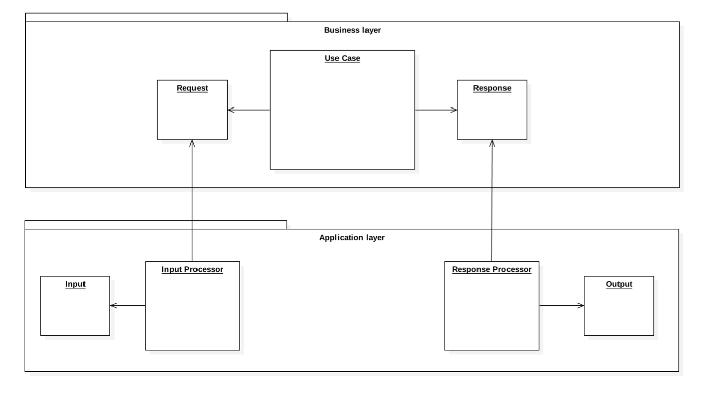

# Use Cases in Symfony

In [the previous chapter](01-concept.md), we have introduced the concept of **Use Cases**, their **Requests** and **Responses**. 
Their purpose is not only to have the intent of your application being clearly reflected in your code structure, but 
also to isolate the business logic from the outside world. This includes stripping the Use Cases of any knowledge about 
the web. Remember from the previous chapter how your users don't care about POST and AJAX? Turns out the business rules 
of your application don't care about them either. Whenever products are being searched by category or added to shopping 
carts, the logic behind these actions is independent from whatever delivery mechanism you choose. Your application is 
expected to behave the same way regardless if the users use it through a web browser, a smartphone app or a desktop program.

To make this distinction clearer, let's introduce the concept of two layers: **Use Case Layer** and **Application Layer**. 
Your Use Cases, naturally, belong to the Use Case Layer. This is where all the business logic lives, unaware of “cookies”, 
“query strings”, “request URIs” or any other worries of the outside world. The business logic is concerned with more 
important stuff: that the product prices are calculated correctly, including due taxes and discounts; that out-of-stock 
products cannot make it into shopping carts; that the orders are properly processed and eventually delivered to your 
happy customers. The Use Cases that execute the business logic take whatever they need from Requests, and communicate 
the results as Responses, or through an interface defined in the Use Case Layer.

Then there is the Application Layer. This is the layer that deals with the Input coming from the user. Input can come in 
different forms, like an HTTP request for web applications or RESTful APIs, command line input for console applications 
or cron jobs, or just a string with the Use Case name and array of its parameters when you run a Behat test. The 
Application Layer does whatever it is necessary to resolve the right Use Case and create the appropriate Use Case Request 
containing data retrieved from the Input. After the Use Case is executed, the Application Layer takes the data from the 
Use Case Response and creates the right Output. It can be HTML code that will be afterwards rendered by the browser, with 
the help of CSS files and JavaScript code. It can just as well be a piece of JSON, text displayed in console, or a green 
bar resulting from successfully run Behat tests.

So you have your business logic perfectly separated from the web. But eventually, you still have to create Use Case Requests
basing on HTTP requests, and convert Use Case Responses into HTTP responses. After all, you are developing with Symfony, 
which means that almost certainly you're building a web application. Maintaining this separation might seem like a lot of
repetitive work, which can be discouraging from taking the Use Case approach altogether. But fear not - Use Case Bundle 
comes with tools that help you reduce the amount of code you have to write for this purpose, allowing you to focus on the
business logic of your application.

Every time you use the Executor to execute a Use Case, it will use an **Input Processor** to extract the data from Input 
into the Request, and a **Response Processor** to create the Output basing on the resulting Response.



The Processors belong to the Application Layer and act as interpreters between the Application Layer and the Use Case 
Layer. The Use Case Bundle already provides a few simple Input and Response Processors. For example, the HTTP Input 
Processor collects all the data from the Symfony HTTP request object (GET and POST parameters, cookies, etc.) and puts 
them into the Request object. The Twig Response Processor uses the Use Case Response as a collection of parameters that 
is passed to a specified Twig template. You will find more information on the bundled Processors in chapter 
[Toolkit](04-toolkit.md).

The bundled Processors will be helpful in simple common cases. However, if the logic behind translating Input into 
Requests and Responses into Output is more complex than a simple mapping, you will have to create your own Processors.

## Input Processors

To implement an Input Processor, create a class that implements ```InputProcessorInterface```. It contains one method: ```initializeRequest()```.

```
<?php
// src/MyBundle/UseCase/MyInputProcessor.php

namespace MyBundle\UseCase;

use Lamudi\UseCaseBundle\Processor\Input\InputProcessorInterface;

class MyInputProcessor implements InputProcessorInterface
{
    public function initializeRequest($request, $input, $options = [])
    {
    }
}

```

The Executor will call this method after the Use Case and its Request have been resolved and created. It will pass the 
Use Case Request as the first argument and the Input as the second. The third argument will contain configuration options 
that can customize the initialization process. These options can be specified in the UseCase annotation, or passed 
directly to the Executor.

For more information on how to configure Input Processors for Use Cases, consult chapter 
[Use Case Contexts](03-use-case-contexts.md).

The Input Processor is useless if it doesn't do anything with the Response or the Input. Let's write a simple 
implementation of the Processor that will rewrite all the GET parameters from the Symfony HTTP request object into 
the Use Case Request.

```
<?php
// src/MyBundle/UseCase/MyInputProcessor.php

namespace MyBundle\UseCase;

use Lamudi\UseCaseBundle\Processor\Input\InputProcessorInterface;
use Symfony\Component\HttpFoundation\Request;

class MyInputProcessor implements InputProcessorInterface
{
    public function initializeRequest($request, $input, $options = [])
    {
        if (!$input instanceof Request) {
            return;
        }

        foreach ($request as $field => &$value) {
            if ($input->query->has($field)) {
                $value = $input->query->get($field);
            }
        }
    }
}
```

Before you can use the Input Processor, register it as Symfony service. The service must have a  ```use_case_input_processor``` 
tag, and an alias that you will later use to identify the Processor. This Processor reads GET parameters from an HTTP request, 
so let's call it ```http_get```.

```
# app/config/services.yml

my_app.input_processor.my:
    class: MyBundle\UseCase\MyInputProcessor
    tags:
        - { name: use_case_input_processor, alias: http_get }
```

Now that the Input Processor has been created and registered, let's use it with our Use Case. In the ```@UseCase``` 
annotation next to the class, add the ```input``` option and provide the alias of the Input Processor as the value. 
In order to make sure that the Input Processor worked, let's simply var_dump the Request object for now.

```
<?php
// src/MyBundle/UseCase/ListProductsInCategory.php

namespace MyBundle\UseCase;

use Lamudi\UseCaseBundle\Annotation\UseCase;

/**
 * @UseCase(input="http_get")
 */
class ListProductsInCategory
{
    public function execute(ListProductsInCategoryRequest $request)
    {
        var_dump($request);
        die;
    }
}

```

It's time to execute the Use Case. In the previous example, we manually created an array of Input data. Now that we have 
an Input Processor in place, we can just pass the entire Request object to it, and the Processor will take care of 
extracting the relevant data into the Use Case Request.

```
<?php
// src/MyBundle/Controller/MyController.php

namespace MyBundle\Controller;

use Symfony\Bundle\FrameworkBundle\Controller\Controller;
use Symfony\Component\HttpFoundation\Request;
use Symfony\Component\Routing\Annotation\Route;

class MyController extends Controller
{
    /**
     * @Route("/category")
     */
    public function myAction(Request $request)
    {
        $response = $this->get('lamudi_use_case.executor')->execute('list_products_in_category', $request);
        return $this->render('MyBundle:products:category.html.twig', (array)$response);
    }
}

```

Now, when you visit the route assigned to this controller action and pass some variables in the query string, you should 
see the var_dumped Request object, with the fields that match the query string variables populated with their values.

## Response Processors

To implement a Request Processor, create a class that extends ```RequestProcessorInterface```. It contains two methods: 
```processResponse()``` and ```handleException()```.

```
<?php
// src/MyBundle/UseCase/VarDumpingResponseProcessor.php

namespace MyBundle\UseCase;

use Lamudi\UseCaseBundle\Processor\Response\ResponseProcessorInterface;
use Symfony\Component\HttpFoundation\Response;

class VarDumpingResponseProcessor implements ResponseProcessorInterface
{
    public function processResponse($response, $options = [])
    {
    }

    public function handleException(\Exception $exception, $options = [])
    {
    }
}

```

When the Use Case is executed successfully (i.e. does not throw an exception), the Executor will call the ```processResponse()``` 
method, passing the Response returned by the Use Case as the first argument. The second argument will contain configuration 
options that can be used by the Processor to customize the Output producing process. When an exception is thrown, however, 
the handleException method will be called with the exception as the first argument and the array of options as the second. 
Just like with Input Processor, these options can be specified in the UseCase annotation, or passed directly to the Executor. 
There is no distinction between options passed in case of success or in case of failure. For more information on how to configure
Response Processors for Use Cases, consult chapter [Use Case Contexts](03-use-case-contexts.md).

Let's implement the Response Processor. This one will just var_dump whatever Response or Exception comes back from the 
Use Case. The var_dumped objects will then be returned in the Content field of an HTTP response.

```
<?php
// src/MyBundle/UseCase/VarDumpingResponseProcessor.php

namespace MyBundle\UseCase;

use Lamudi\UseCaseBundle\Processor\Response\ResponseProcessorInterface;
use Symfony\Component\HttpFoundation\Response;

class VarDumpingResponseProcessor implements ResponseProcessorInterface
{
    public function processResponse($response, $options = [])
    {
        ob_start();
        var_dump($response);
        $dump = ob_get_clean();

        return new Response($dump);
    }

    public function handleException(\Exception $exception, $options = [])
    {
        ob_start();
        var_dump($exception);
        $dump = ob_get_clean();

        return new Response($dump);
    }
}

```

Similarly to Input Processors, Response Processors must be registered, otherwise the Executor will not be able to resolve 
it. For this purpose you need to use a ```use_case_response_processor``` tag with ```alias``` option. Because var_dumping 
everything is dumb, let's call this Processor ```var_dumb```.

```
# app/config/services.yml

my_app.response_processor.var_dumping:
    class: MyBundle\UseCase\VarDumpingResponseProcessor
    tags:
        - { name: use_case_response_processor, alias: var_dumb }
```

Assigning a Response Processor to a Use Case is done in the same way as assigning an Input Processor, except for the option name, which is ```response```.

Right now the Use Case does not return anything. Let's make it return a simple Response in order to see that everything works fine.
We should also test the alternative course of action for the Use Case. For that, let's make the Use Case more interactive. 
It should throw an exception whenever the string ```missing_category``` is passed as the category ID.

```
<?php
// src/MyBundle/UseCase/ListProductsInCategory.php

namespace MyBundle\UseCase;

use Lamudi\UseCaseBundle\Annotation\UseCase;

/**
 * @UseCase(input="http_get")
 */
class ListProductsInCategory
{
    public function execute(ListProductsInCategoryRequest $request)
    {
        if ($request->categoryId == 'missing_category') {
            throw new CategoryNotFoundException();
        } else {
            return new ListProductsInCategoryResponse();
        }
    }
}
```

Notice that in this example we threw a ```CategoryNotFoundException``` instead of a generic PHP exception. This allows us to 
distinct the expected alternative courses, like nonexistent categories (users could accidentally or deliberately enter 
an invalid category ID in the URL), from unexpected failures (for example, the database should always work). The 
```CategoryNotFoundException``` extends the ```AlternativeCourseException``` that belongs to the Use Case Bundle. The ```AlternativeCourseException``` 
is handled differently than other kinds of exceptions by the Response Processors that come with the Bundle. 

We have to make one small adjustment in the controller code. Now that the Executor will push the Use Case Response through 
the Processor that will return an HTTP response, we can directly return the result of the ```execute()``` method call, 
reducing the number of lines of code in the controller action to a grand total of one.

```
<?php
// src/MyBundle/Controller/MyController.php

namespace MyBundle\Controller;

use Symfony\Bundle\FrameworkBundle\Controller\Controller;
use Symfony\Component\HttpFoundation\Request;
use Symfony\Component\Routing\Annotation\Route;

class MyController extends Controller
{
    /**
     * @Route("/category")
     */
    public function my3Action(Request $request)
    {
        return $this->get('lamudi_use_case.executor')->execute('list_products_in_category', $request);
    }
}

```

Now execute the controller action in the browser. You should see the var_dumped Response object. If you go to the URL 
that contains ```categoryId=missing_category``` in the query string, you should see the var_dumped exception.

### Input Aware Response Processors

Sometimes it might be necessary for the Response Processor to know something that the Input contains. For example, 
consider the HTTP ```Accept``` header: it is used to request a response in certain format. The contents of this header, 
however, should not be known to the Use Case, because a HTTP request header is something that belongs to the Application 
Layer.

For this purpose you can make your Response Processor implement ```InputAwareResponseProcessorInterface```. Additionally
to the methods of ```ResponseProcessorInterface``` it contains ```setInput()``` method. This method will used by the
Executor to pass the Input object to your Response Processor.


## Conclusion

In this chapter, we discussed how the business logic of your application must stay independent from the delivery mechanism.
We also presented the tools that will help you focus on implementing the business logic by eliminating the code necessary
for processing user Input and displaying Output from the Use Cases.

In [the next chapter](03-use-case-contexts.md) you will find out how to configure what Processors the Executor will use 
to execute the Use Cases.
